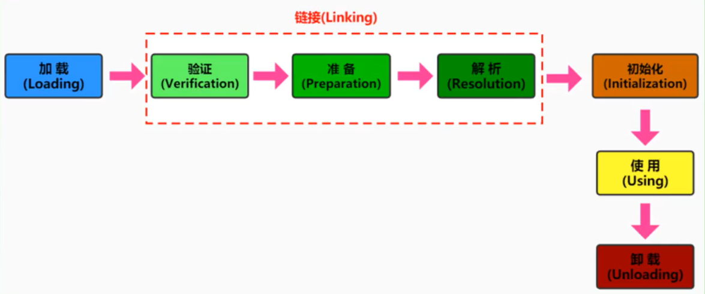
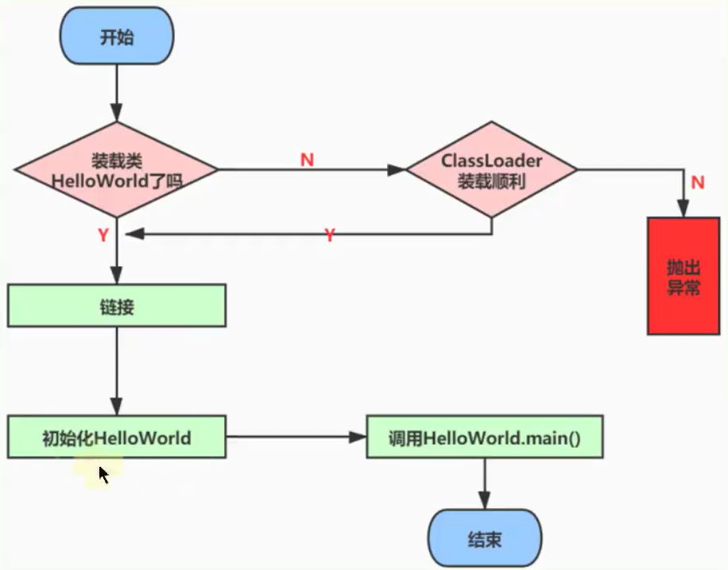
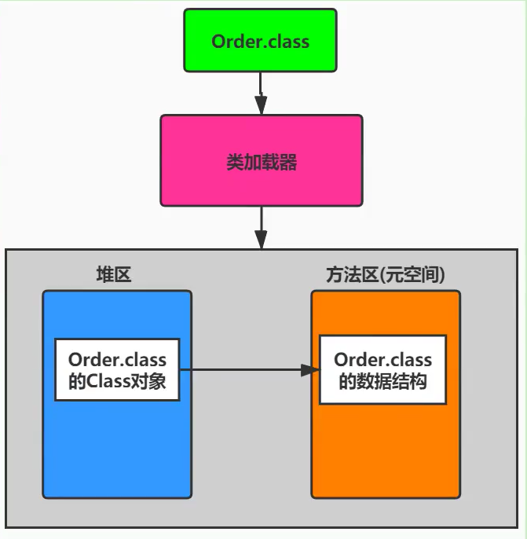
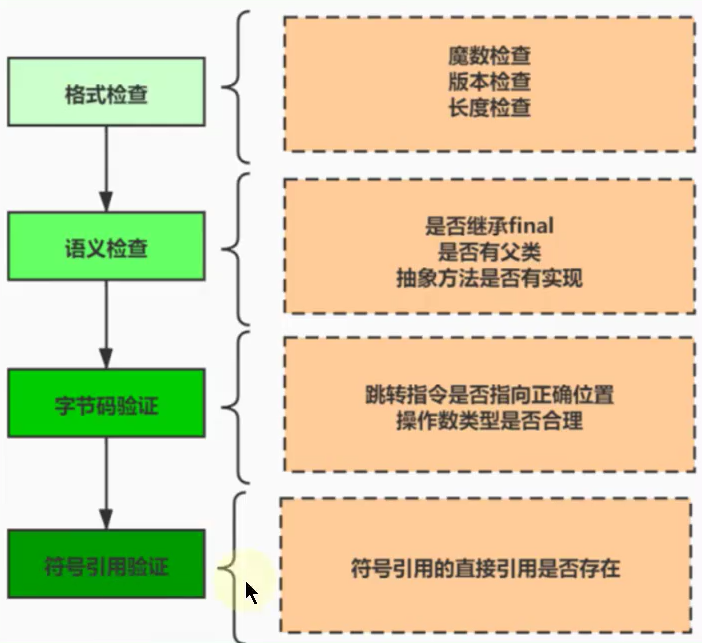
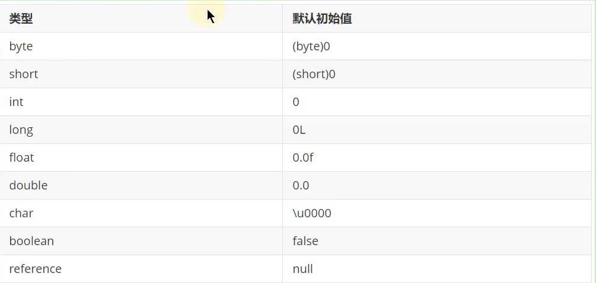
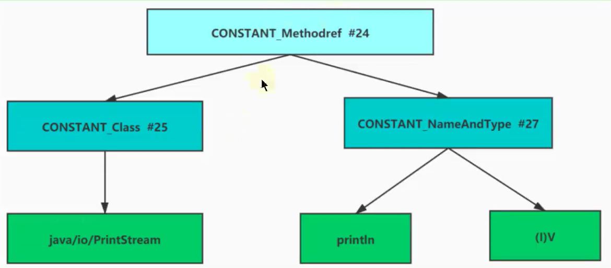
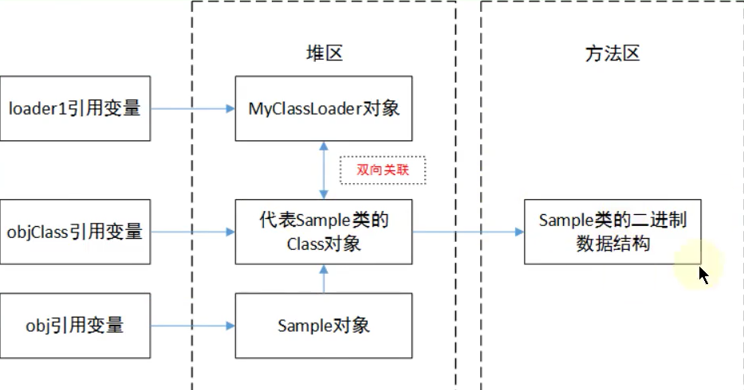

# 类的加载过程(类的生命周期)

## 概述

在Java中数据类型分为基本数据类型和引用数据类型。**基本数据类型由虚拟机预先定义，引用数据类型则需要进行类的加载**

按照Java虚拟机规范，从 class文件到加载到内存中的类，到类卸载出内存为止，它的整个生命周期包括如下7个阶段：



其中，验证、准备、解析3个部分统称为链接（ Linking

从程序中类的使用过程看：



### 大厂面试提：

**蚂蚁金服**

描述一下JVM加载C1ass文件的原理机制？
一面：类加载过程

**百度**

类加载的时机java类加载过程？
简述java类加载机制？

**腾讯：**
JVM中类加载机制，类加载过程？

**滴滴**

JVM类加载机制

**美团**

Java类加载过程

描述一下jvm加载c1ass文件的原理机制

**京东**

什么是类的加载？
哪些情况会触发类的加载？
讲一下JVM加载一个类的过程

JVM的类加载机制是什么？

## Loading（加载）阶段

### 加载完成的操作

**加载的理解**

**所谓加载，简而言之就是将Java类的字节码文件加载到机器内存中，并在内存中构建出ava类的原型模板对象**。所谓类模板对象，其实就是Java类在JVM内存中的一个快照，JVM将从字节码文件中解析岀的常量池、类字段、类方法等信息存储到类模板中，这样JM在运行期便能通过类模板而获取Java类中的仼意信息，能够对Java类的成员变量进行遍历，也能进行Java方法的调用。
反射的机制即基于这一基础。如果JWM没有将Java类的声明信息存储起来，则JVM在运行期也无法反射。

**加载完成的操作**

**加载阶段，简言之，查找并加载类的二进制数据，生成 Class的实例**

在加载类时，Java虚拟机必须完成以下3件事情：

- 通过类的全名，获取类的二进制数据流。
- 解析类的二进制数据流为方法区内的数据结构（Java类模型）
- 创建java.lang.Class类的实例，表示该类型。作为方法区这个类的各种数据的访问入口

### 二进制流的获取方式

对于类的二进制数据流，虚拟机可以通过多种途径产生或获得。（**只要所读取的字节码符合WM规范即可**）

- 虚拟机可能通过文件系统读入一个c1ass后缀的文件（**最常见**）
- 读入jar、zip等归档数据包，提取类文件。
- 事先存放在数据库中的类的二进制数据
- 使用类似于HTTP之类的协议通过网络进行加载
- 在运行时生成一段Class的二进制信息等

在获取到类的二进制信息后，Java虚拟机就会处理这些数据，并最终转为一个java.1 ang Class的实例。

如果输入数据不是 ClassFile的结构，则会抛出 ClassFormatError。

### 类模型与Class实例的位置

**类模型的位置**

加载的类在JVM中创建相应的类结构，类结构会存储在方法区（JDK1.8之前：永久代；JDK1.8及之后：元空间）

**Class实例的位置**

类将class文件加载至元空间后，会在堆中创建一个Java.lang.Class对象，用来封装类位于方法区内的数据结构，该Class对象是在加载类的过程中创建的，每个类都对应有一个C1ass类型的对象。

**图示:**



外部可以通过访问代表 Order类的 Class对象来获取 Order的类数据结构。

**再说明**

Class类的构造方法是私有的，只有JVM能够创建。

java.lang. Class实例是访问类型元数据的接口，也是实现反射的关键数据、入口。通过Class类提供的接口，可以获得目标类所关联的. class文件中具体的数据结构：方法、字段等信息

### 数组类的加载

创建数组类的情况稍微有些特殊，**因为数组类本身并不是由类加载器负责创建**，而是由JVM在运行时根据需要而直接创建的但数组的元素类型仍然需要依靠类加载器去创建。创建数组类（下述简称A）的过程：

- 如果数组的元素类型是引用类型，那么就遵循定义的加载过程递归加载和创建数组A的元素类型；
- JVM使用指定的元素类型和数组维度来创建新的数组类。

如果数组的元素类型是引用类型，数组类的可访问性就由元素类型的可访问性决定。否则数组类的可访问性将被缺省定义为public

## Linking（连接）阶段

### 链接阶段之 Verification验证）

当类加载到系统后，就开始链接操作，验证是链接操作的第一步。

**它的目的是保证加载的字节码是合法、合理并符合规范的。**

验证的步骤比较复杂，实际要验证的项目也很繁多，大体上Java虚拟机需要做以下检査，如图所示。



**整体说明:**

验证的内容则涵盖了类数据信息的格式验证、语义检查、字节码验证，以及符号引用验证等

- 其中格式验正会和加载阶段一起执行。险证通过之后，类加载器才会成功将类的二进制数据信息加载到方法区中
- 格式验证之外的验证操作将会在方法区中进行。

链接阶段的验证虽然拖慢了加载速度，但是它避免了在字节码运行时还需要进行各种检查。（磨刀不误砍柴工）

**具体说明：**

==格式验证==：是否以魔数 XCAFEBABE开头，主版本和副版本号是否在当前Java虚拟机的支持范围内，数据中每一个项是否都拥有正确的长度等。

Java虚拟机会进行字节码的语义检查，但凡在语义上不符合规范的，虚拟机也不会给予验证通过。比如:

- 是否所有的类都有父类的存在（在java里，除了Object外，其锺类都应该有父类）

- 是否一些被定义为final的方法或者类被重写或继承了非抽象类
- 是否实现了所有抽象方法或者接口方法
- 是否存在不兼容的方法（比如方法的签名除了返回值不同，其他都一样，这种方法会让虚拟机无从下手调度； abstract情况下的方法，就不能是final的了）

Java虚拟机还会进行==字节码验证==，字节码验证也是**验证过程中最为复杂的一个过程**。它试图通过对字节码流的分析，判断字节码是否可以被正确地执行。比如:

- 在字节码的执行过程中，是否会跳转到一条不存在的指令
- 函数的调用是否传递了正确类型的参数
- 变量的赋值是不是给了正确的数据类型等

栈映射帧（ StackMapTable）就是在这个阶段，用于检测在特定的字节码处，其局部变量表和操作数栈是否有着正确的数据类型。
但遗憾的是，1θ8%准确地判断一段字节码是否可以被安全执行是无法实现的，因此，该过程只是尽可能地检查出可以预知的星的问题。如果在这个阶段无法通过检查，虚拟机也不会正确装载这个类。但是，如果通过了这个阶段的检查，也不能说明这个类是完全没有问题的

**在前面3次检査中，已经排除了文件格式错误、语义错误以及字节码的不正确性。但是依然不能确保类是没有问题的。**

校验器还将==进行符号引用的验证==。 Class文件在其常量池会通过字符串记录自己将要使用的其他类或者方法。因此，在验证阶段，**虚拟机就会检査这些类或者方法确实是存在的**，并且当前类有权限访问这些数据，如果一个需要使用类无法在系统中找到，则会抛出 NoClassDeffounderror，如果一个方法无法被找到，则会抛出 NoSuchMethoderror。此阶段在解析环节才会执行。

### 链接阶段之 Preparation（准隹备）

**准备阶段（ Preparation），简言之，为类的静态变量分配内存，并将其初始化为默认值**

当一个类验证通过时，虚拟机就会进入准备阶段。在这个阶段，虚拟机就会为这个类分配相应的内存空间，并设置默认初始值。
Java虚拟机为各类型变量默认的初始值如表所示。



注意：Java并不支持 boolean类型，对于 boolean类型，内部实现是int，由于int的默认值是0，故对应的， boolean的默认值就是false。

注意：

- **这里不包含基本数据类型的字段用 static final修饰的情况，因为fina1在编译的时候就会分配了，准备阶段会显式赋值。**
- 注意这里不会为实例变量分配初始化，类变量会分配在方法区中，而实例变量是会随着对象一起分配到Java堆中
- 在这个阶段并不会像初始化阶段中那样会有初始化或者代码被执行。

### 链接阶段之 Resolution（解析）

在准备阶段完成后，就进入了解析阶段。

**解析阶段（ Resolution），简言之，将类、接口、字段和方法的符号引用转为直接引用**

**具体描述：**

符号引用就是一些字面量的引用，和虚拟机的内部数据结构和和内存布局无关。比较容易理解的就是在 Class类文件中，通过常量池进行了大量的符号引用。但是在程序实际运行时，只有符号引用是不够的，比如当如下 println（）方法被调用时，系统需要明确知道该方法的位置。

以方法为例，Java虚拟机为每个类都准备了一张方法表，将其所有的方法都列在表中，当需要调用一个类的方法的时候，只要知道这个方法在方法表中的偏移量就可以直接调用该方法。**通过解析操作，符号引用就可以转变为目标方法在类中方法表中的位置，从而使得方法被成功调用。**

举例：输出操作 System.out. print1n（）对应的字节码：invokevirtual #24 <java/io/PrintStream printin>



以方法为例，Java虚拟机为每个类都准备了一张方法表，将其所有的方法都列在表中，当需要调用一个类的方法的时候只要知道这个方法在方法表中的偏移量就可以直接调用该方法。**通过解析操作，符号引用就可以转变为目标方法在类中方法表中的位置，从而使得方法被成功调用**

**小结：**

所谓解析就是将符号引用转为直接引用，也就是得到类、宇段、方法在内存中的指针或者偏移量。因此，可以说，如果直接引用存在，那么可以肯定系统中存在该类、方法或者字段。但只存在符号引用，不能确定系统中一定存在该结构。

不过Java虚拟机规范并没有明确要求解析阶段一定要按照顺序执行。在 HotSpot VM中，加载、验证、准备和初始化会按照顺序有条不紊地执行，但链接阶段中的解析操作往往会伴随着JVM在执行完初始化之后再执行。

**字符串的复习**:

最后，再来看一下 CONSTANT_ String的解析。由于字符串在程序开发中有着重要的作用，因此，读者有必要了解一下String在Java虚拟机中的处理。**当在Java代码中直接使用字符串常量时，就会在类中出现 CONSTANT_String**，它表示字符串常量，并且会引用一个 CONSTANT_UTF8的常量项。**在Java虚拟机内部运行中的常量池中，会维护一张字符串拘留表（ intern），它会保存所有出现过的字符串常量，并且没有重复项**。只要以 CONSTANT_String形式出现的字符串也都会在这张表中。使用 String. intern（）方法可以得到一个字符串在拘留表中的引用，因为该表中没有重复项，所以任何字面相同的字符串的String.intern()方法返回总是相等的

## Initialization（初始化）阶段

**初始化阶段，简言之，为类的静态变量赋予正确的初始值**

**具体描述**

类的初始化是类装载的最后一个阶段。如果前面的步骤都没有问题，那么表示类可以顺利装载到系统中。此时，类才会开始执行Java宇节码。（即：到了初始化阶段，才真正开始执行类中定义的Java程序代码。）

初始化阶段的重要工作是执行类的初始化方法：<c1init>（）方法

- 该方法仅能由Java编译器生成并由JVM调用，程序开发者无法自定乂一个同名的方法，更无法直接在Java程序中调用该方法，虽然该方法也是由字节码指令所组成
- 它是由类静态成员的赋值语句以及 static语句块合并产生的

**说明**

在加载一个类之前，虚拟机总是会试图加载该类的父类，因此父类的<c1init>总是在子类< clinit>之前被调用也就是说，父类的 static块优先级高于子类

Java编译器并不会为所有的类都产生< clinit>（）初始化方法。哪些类在编译为字节码后，字节码文件中将不会包含<c1init>（）方            法？  

- 一个类中并没有声明任何的类变量，也没有静态代码块时
- 一个类中声明类变量，但是没有明确使用类变量的初始化语句以及静态代码块来执行初始化操作时
- 个类中包含 static finall修饰的基本数据类型的字段，这些类字段初始化语句用编译时常量表达式

```java
/**
 * @Author: HFwas
 * @Date: 2021/2/1
 * @Description: com.hfwas.java1.chapter03
 * 那些场景下，Java编译器就不会生成<clinit>()方法
 * @version: 1.0
 */
public class InitializationTest1 {
    //场景1：对于非静态的字段，不管是否进行了显示赋值，都不会生成<clinit>()方法
    public int num = 1;
    //场景2：静态的字段，没有显示的赋值，不会生成<clinit>()方法
    public static int num2;
    //场景3：比如对于声明为static final的基本数据类型的字段，不管是否进行了显示赋值，都不会生成<clinit>()方法
    public static final int num3 = 1;
}
```


### static与final的搭配问题


### <clinit>()的线程安全性

对于< clinit>（）方法的调用，也就是类的初始化，虚拟机会在内部确保其多线程环境中的安全性。

虚拟机会保证一个类的< clinit>（）方法在多线程环境中被正确地加锁、同步，如果多个线程同时去初始化一个类，那么只会有一个线程去执行这个类的<c1init>（）方法，其他线程都需要阻塞等待，直到活动线程执行<c1init>（）方法完毕。

**正是因为函数<c1init>（）带锁线程安全的**，因此，如果在一个类的<c1init>（）方法中有耗时很长的操作，就可能造成多个线程阻塞，引发死锁。并且这种死锁是很难发现的，因为看起来它们并没有可用的锁信息

如果之前的线程成功加载了类，则等在队列中的线程就没有机会再执行<c1init>（）方法了。那么，当需要使用这个类时，虚拟机会直接返回给它已经准备好的信息

### 类的初始化情况：主动使用vs被动使用

-XX:+TraceClassLoading

Java程序对类的使用分为两种：主动使用和被动使用。

**主动使用:**

Class只有在必须要首次使用的时候才会被装载，Java虚拟机不会无条件地装载 Class类型。Java虚拟机规定，一个类或接口在初次使用前，必须要进行初始化。这里指的“使用”，是指主动使用，主动使用只有下列几种情况：（即：如果出现如下的情况，则会对类进行初始化操作。而初始化操作之前的加载、验证、准备已经完成。）

- 当创建一个类的实例时，比如使用new关键字，或者通过反射、克隆、反序列化
- 当调用类的静态方法时，即当使用了字节码 invokestatic指令。
- 当使用类、接口的静态字段时（final修饰特殊考虑），比如，使用 getstatic或者 putstatic指令。（对应访问变量赋值变量操作）
- 当使用java.lang.reflect包中的方法反射类的方法时。比如：Class. forName（"' com.atguigu.java.Test"）
- 当初始化子类时，如果发现其父类还没有进行过初始化，则需要先触发其父类的初始化
- 如果一个接口定义了 default方法，那么直接实现或者间接实现该接口的类的初始化，该接口要在其之前被初始化。
- 当虚拟机启动时，用户需要指定一个要执行的主类（包含main（）方法的那个类），虚拟机会先初始化这个主类
- 当初次调用 Methodhandle实例时，初始化该 Methodhandle指向的方法所在的类。（涉及解析REF_getstatic、REF_ putstatic、 REF_invokestatic方法句柄对应的类）

**针对5，**补充说明当Java虚拟机初始化一个类时，要求它的所有父类都已经被初始化，但是这条规则并不适用于接口

- 在初始化一个类时，并不会先初始化它所实现的接口
- 在初始化一个接口时，并不会先初始化它的父接口

因此，一个父接口并不会因为它的子接口或者实现类的初始化而初始化。只有当程序首次使用特定接口的静态字段时，才会导致该接口的初始化

**针对7，说明:**

JVM启动的时候通过引导类加载器加载一个初始类。这个类在调用pub1 ic static void main（ String【】）方法之前被链接和初始化。这个方法的执行将依次导致所需的类的加载，链接和初始化。

**被动使用:**

除了以上的情况属于主动使用，其他的情况均属于被动使用。**被动使用不会引起类的初始化。**
也就是说：**并不是在代码中出现的类，就一定会被加载或者初始化。如果不符合主动使用的条件，类就不会初始化**

- 当访问一个静态字段时，只有真正声明这个字段的类才会被初始化
  - 当通过子类引用父类的静态变量，不会导致子类初始化
- 通过数组定义类引用，不会触发此类的初始化
- 引用常量不会触发此类或接口的初始化。因为常量在链接阶段就已经被显式赋值了。
- 调用Classloader类的 loadclass（）方法加载一个类，并不是对类的主动使用，不会导致类的初始化

## 类的Using（使用）

任何一个类型在使用之前都必须经历过完整的加载、链接和初始化3个类加载步骤。一旦一个类型成功经历过这3个步骤之后，便“万事俱备，只欠东风”，就等着开发者使用了。

开发人员可以在程序中访问和调用它的静态类成员信息、（比如：静态字段、静态方法），或者使用new关键字为其创建对象实例。

## 类的Unloading（卸载）

**类、类的加载器、类的实例之间的引用关系**

在类加载器的内部实现中，用一个java集合来存放所加载类的引用。另一方面，一个Class对象总是会引用它的类加载器调用 Class对象的 getClassLoader（）方法，就能获得它的类加载器。由此可见，代表某个类的Class实例与其类的加载器之间为双向关联关系

个类的实例总是引用代表这个类的Class对象。在0Object类中定义了getClass（）方法，这个方法返回代表对象所属类的Class对象的引用。此外，所有的java类都有一个静态属性class，它引用代表这个类的C1ass对象、

**类的生命周期**

当 Sample类被加载、链接和初始化后，它的生命周期就开始了。当代表 Sample类的 Class对象不再被引用，即不可触及时，℃Lass对象就会结束生命周期， Sample类在方法区内的数据也会被卸载，从而结束samp1e类的生命周期

一个类何时结束生命周期，取决于代表它的C1ass对象何时结束生命周期具体例子

**具体例子：**



loader1变量和obj变量间接应用代表Sample类的Class对象，而objClass变量则直接引用它

如果程序运行过程中，将上图左侧三个引用变量都置为nu11，此时 Sample对象结束生命周期，Myclassloader对象结束生命周期，代表 Sample类的C1ass对象也结束生命周期， Sample类在方法区内的二进制数据被卸载

当再次有需要时，会检查Samp1e类的C1ass对象是否存在，如果存在会直接使用，不再重新加载；如果不存在 Sample类会被重新加载，在Java虚拟机的堆区会生成一个新的代表 Sample类的C1ass实例（可以通过哈希码查看是否是同一个实例

**类的卸载**

- 启动类加载器加载的类型在整个运行期间是不可能被卸载的（jvm和jls规范）
- 被系统类加载器和扩展类加载器加载的类型在运行期间不太可能被卸载，因为系统类加载器实例或者扩展类的实例基本上在整个运行期间总能直接或者间接的访问的到，其达到 unreachab1e的可能性极小
- 被开发者自定义的类加载器实例加载的类型只有在很简单的上下文环境中才能被卸载，而且一般还要借助于强制调用虚拟机的垃圾收集功能才可以做到。可以预想，稍微复杂点的应用场景中（比如：很多时候用户在开发自定义类加载器实例的时候采用缓存的策略以提髙系统性能），被加载的类型在运行期间也是几乎不太可能被卸载的（至少卸载的时间是不确定的）

综合以上三点，一个已经加载的类型被卸载的几率很小至少被卸载的时间是不确定的。同时我们可以看的出来，开发者在开发代码时候，不应该对虚拟机的类型卸载做任何假设的前提下，来实现系统中的特定功能

### 回顾：方法区的垃圾回收

方法区的垃圾收集主要回收两部分内容：**常量池中废弃的常量**和**不再使用的类型**

HotSpot，虚拟机对常量池的回收策略是很明确的，只要常量池中的常量没有被任何地方引用，就可以被回收

判定一个常量是否“废弃”还是相对简单，而要判定一个类型是否属于“不再被使用的类”的条件就比较苛刻了。需要同时满足下面三个条件

- **该类所有的实例都已经被回收。也就是Java堆中不存在该类及其任何派生子类的实例**
- **加载该类的类加载器已经被回收。这个条件除非是经过精心设计的可替换类加载器的场景，如OSGi、JSP的重加载等，否则通常是很难达成的**
- **该类对应的java.lang.Class对象没有在任何地方被引用，无法在任何地方通过反射访问该类的方法。**

Java虚拟机被允许对满足上述三个条件的无用类进行回收，这里说的仅仅是“被允许”，而并不是和对象一样，没有引用了就必然会回收。


