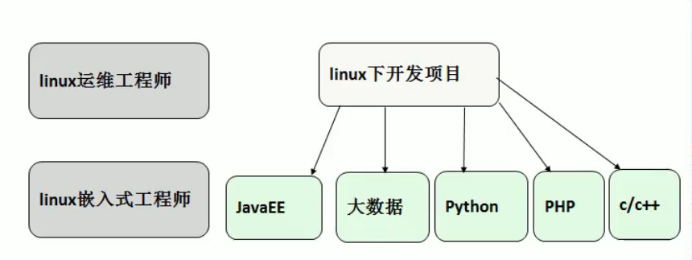
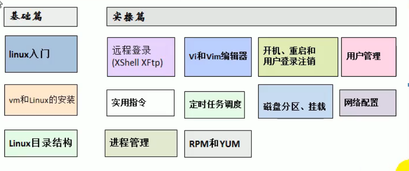
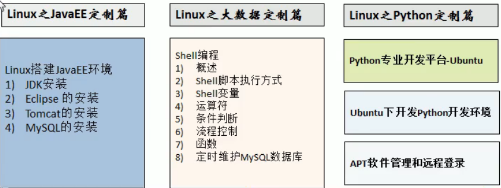

[toc]

# 课程介绍

## 学习方向

## 课程内容

## Linux应用领域

### 个人桌面领域的应用

此领域是传统Linux应用最薄弱的坏节，传统Linux由于界面简单、操作复杂、应用软件少的缺点，一直被 windows所压制，但近些年来随着 ubuntu、 fedora'd：】等优秀桌面环境的兴起同时各大硬件厂商对其支持的加大， linux在个人桌面领域的占有率在逐渐的提高。

### 服务器领域

Linux在服务器领域的应用是最强的。

Linux免费、稳定、高效等特点在这里得到了很好的体现，近些年来Linux服务器市场得到了飞速的提升，尤其在一些高端领域尤为广泛。

### 嵌入式领域

近些年来Linux在嵌入式领域的应用得到了飞速的提高Linux运行稳定、对网络的良好支持性、低成本，且可以根据需要进行软件裁剪，内核最小可以达到几百KB等特点，使其近些年来在嵌入式领域的应用得到非常大的提高

主要应用：**机顶盒**、数字电视、网络电话、程控交换机、手机、PDA、智能家居、智能硬件等都是其应用领域。**以后再物联网中应用会更加广泛**

## Linux进阶

Linux是一个开源、免费的操作系统，其稳定性、安全性、处理多并发已经得到业界的认可，目前很多中型，大型甚至是集群项目都在使用Linux，很多软件公司考虑到开发成本都首选Linux，在中国软件公司得到广泛的使用，我个人认为学习Linux流程为：

1. **第1阶段**：Linux环境下的基本操作命令，包括
   1. 文件操作命令（ rm mkdir chmod, chown）
   2. 编辑工具使用（ vi vim）
   3. Linux用户管理（ useradd userdel usermod）等
2. **第2阶段**：Linux的各种配置
   1. 环境变量配置
   2. 网络配置
   3. 服务配置
3. **第3阶段**：Linux下如何搭建对应语言的开发环境
   1. 大数据
   2. JavaEE 
   3. Python等
4. **第4阶段**：能编写shell脚本，对Linux服务器进行维护。
5. **第5阶段**：能进行安全设置，防止攻击，保障服务器正常运行，能对系统调优。
6. **第6阶段**：深入理解Linux系统（对內核有硏究），熟练掌握大型网站应用架构组成、并熟悉各个环节的部署和维护方法。

## 学习方法与建议

- 高效而愉快的方法
- 先建立一个整体框架，然后细节
- 不需要掌握所有的Linux指令，要学会查询手册和百度
- 先 know how，再 know why
- 计算机是一门”做中学”的学科，不是会了再做，而是做了才会
- 适当的囫囵吞枣
- Linux不是编程，重点是实际操作，各种常用指令要玩的溜

