[toc]

# 组管理和权限管理

## Linux组基本介绍

- Linux中每个用户属于一个组，不能独立于组以外。所以在Linux中每个文件存在组的概念：
  1. 所有者
  2. 所在组
  3. 其他组
  4. 改变用户所在组

## 文件/目录所有者

> 一般为文件的创建者，谁创建了该文件，就自然的称为该文件的所有者。

- 查看文件所有者：ls -ahl
  - 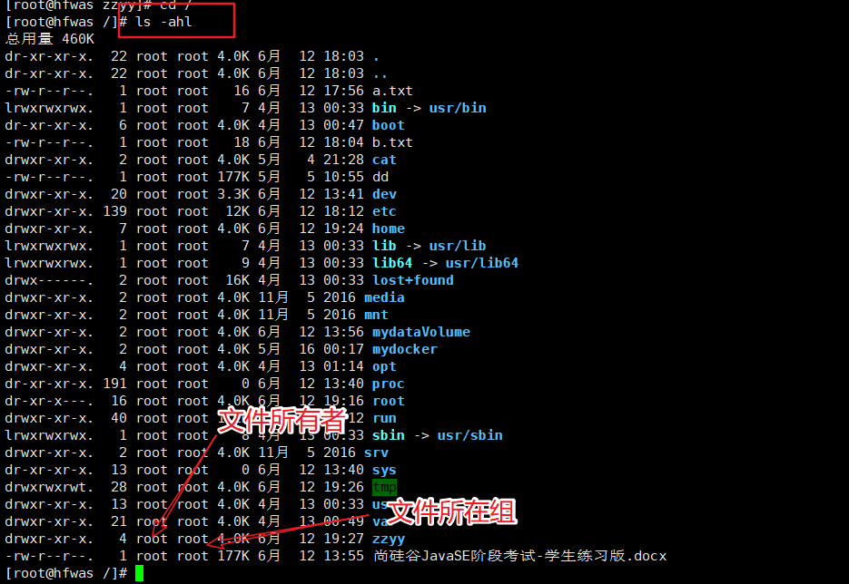
- 修改文件所有者：chown (用户名) (文件名)
  - 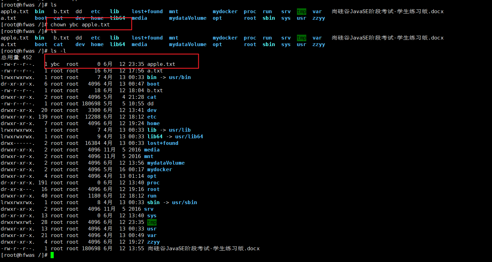

## 文件/目录所在组

> 当某个用户创建了一个文件之后，默认之歌文件所在组就是该用户所在的组

- 查看文件所有者：ls -ahl
- 修改文件所在组：chgrp (组名) (文件名)
  - 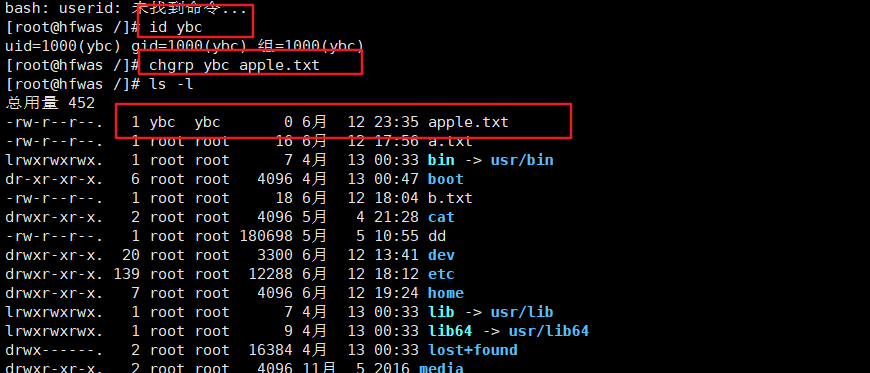

## 其他组

> 除文件的所有者和所在组的用户外，系统的其他用户都是文件的其他组

## 改变用户所在组中

再添加用户时，可以指定将该用户添加到哪个组中，同样的用root的管理权限可以改变某个用户所在的组。

- usermod     -g     组名        用户名
- usermod         -d   目录名     用户名     改变该用户登陆的初始目录。

- 应用实例
  - 创建一个土匪组（ bandit）将tom这个用户从原来所在的 police组，修改到bandit土匪组
  - 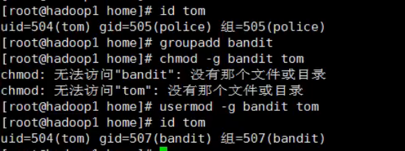

## 文件属性

- ls -l中显示的内容如图所示 

1. 在Linux中第一个字符代表这个文件是目录、文件或链接文件等等。
   - 当为[ d ]则是目录
   - 当为[ - ]则是文件；
   - 若是[ l ]则表示为链接文档(link file)；软连接
   - 若是[ b ]则表示为装置文件里面的可供储存的接口设备(可随机存取装置)；
   - 若是[ c ]则表示为装置文件里面的串行端口设备，例如键盘、鼠标(一次性读取装置)。
2. 接下来的字符中，以三个为一组，且均为『rwx』 的三个参数的组合。[ r ]代表可读(read)、[ w ]代表可写(write)、[ x ]代表可执行(execute)。 要注意的是，这三个权限的位置不会改变，如果没有权限，就会出现减号[ - ]而已。 每个文件的属性由左边第一部分的10个字符来确定

### rwx权限详解

- rwx作用到文件：
  - r：read，可读。读取查看。
  - w：write，可以修改。但不代表可以删除该文件。删除一个文件的前提条件是对该文件所在的目录有写权限，才能删除该文件。
  - x：execute，可执行。可以被执行。
- rwx作用到目录：
  - r：可以读取，ls查看目录内容。
  - w：可以修改，目录内创建+删除+重命名目录。
  - x：可执行，可以进入该目录。

## 文件及目录权限实际案例

ls -l 中显示的内容如下：

-rwxrw-r-- l root root 1213 Feb 2 09:39 abc

10个字符确定不同用户能对文件干什么

第一个字符代表文件类型：文件（）目录（d，链接

其余字符每3个—组wx）读（写w执行（x）

第一组rwx：文件拥有者的权限是读、写和执行

第二组rw-：与文件拥有者同一组的用户的权限是读、写但不能执行

第三组r--：不与文件拥有者同组的其他用户的权限是读不能写和执行

可用数字表示为：r=4，w=2，x=1因此rwx=4+2+1=7

| 1           | 文件：硬连接数或目录：子目录数                  |
| ----------- | ----------------------------------------------- |
| root        | 用户                                            |
| root        | 组                                              |
| 1213        | 文件大小(字节），**如果是文件夹，显示4096字节** |
| Feb 2 09:39 | 最后修改日期                                    |
| abc         | 文件名                                          |

### 修改权限

#### chgrp：更改文件属组

- chgrp [-R] 属组名 文件名
  - -R：递归更改文件属组，就是在更改某个目录文件的属组时，如果加上-R的参数，那么该目录下的所有文件的属组都会更改。
  - 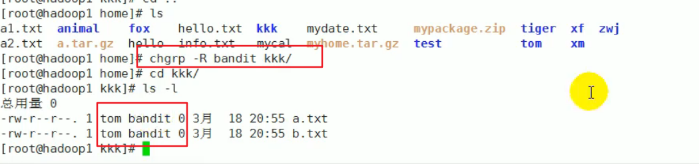

#### chown：更改文件属主，也可以同时更改文件属组

基本介绍:

- chown newowner file改变文件的所有者

- chown newowner:newgroup file    改变用户的所有者和所有组

- -R   如果是目录则使其下所有子文件或目录递归生效

案例演示：

- 请将/home/abc.tt文件的所有者修改成tom
  - 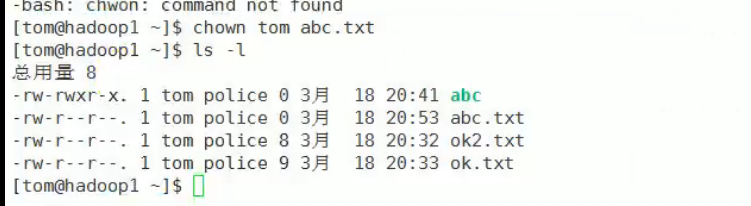
- 请将/home/k目录下所有的文件和目录的所有者都修改成tom
  - 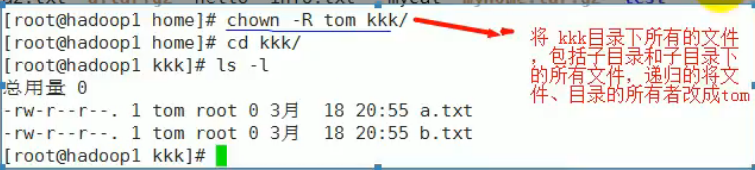

#### chmod：更改文件9个属性

##### 第一种方式：+、-、=变更权限

u：所有者，g：所有组，o：其他人，a：所有人{u、g、o的总和）

- chmod u=rwx ,g=rx o=x 文件目录名

- chmod o+w 文件目录名
- chmod a-x 文件目录名

- 案例演示
  - 给abc文件的**所有者读写执行的权限**，给**所在组读执行权限**，给**其它组读执行权限**
    - 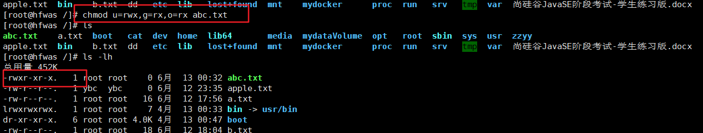
  - 给abc文件的**所有者除去执行的权限**，**增加组写的权限**
    - 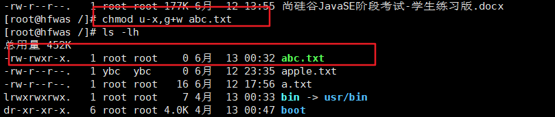
  - 给abc文件的**所有用户添加读的权限**
    - 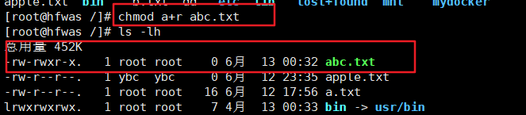

- Linux文件属性有两种设置方法，一种是数字，一种是符号。
- Linux文件的基本权限就有九个，分别是owner/group/others三种身份各有自己的read/write/execute权限。
- 

##### 使用数字修改权限

- 我们可以使用数字来代表各个权限，各权限的分数对照表如下：
  - r:4
  - w:2
  - x:1
- 每种身份(owner/group/others)各自的三个权限(r/w/x)分数是需要累加的，例如当权限为： [-rwxrwx---] 分数则是：
  - owner = rwx = 4+2+1 = 7
  - group = rwx = 4+2+1 = 7
  - others= --- = 0+0+0 = 0

- chmod [-R] xyz 文件或目录
  - xyz : 就是刚刚提到的数字类型的权限属性，为 rwx 属性数值的相加。
  - -R : 进行递归(recursive)的持续变更，亦即连同次目录下的所有文件都会变更
  - 举例来说，如果要将.bashrc这个文件所有的权限都设定启用，那么命令如下： 

### 最佳实践警察和土匪游戏

police, bandit

 jack,jery：警察xh,xq：土匪

- 创建组
  - 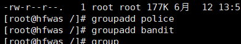
- 创建用户
  - 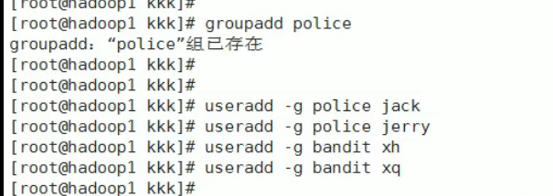
- jack创建一个文件，自己可以读写，本组人可以读，其它组没人任何权限
  - 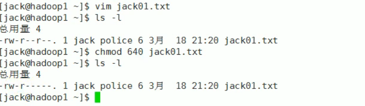
- jack修改该文件，让其它组人可以读，本组人可以读写
  - 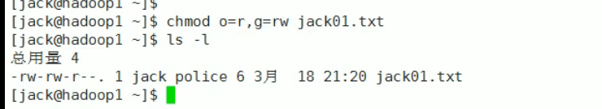
- xh投靠警察，看看是否可以读写
  - 