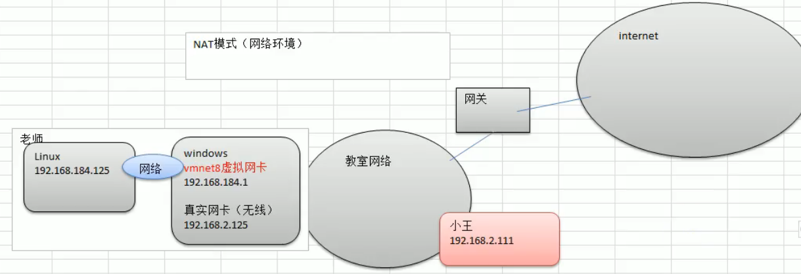
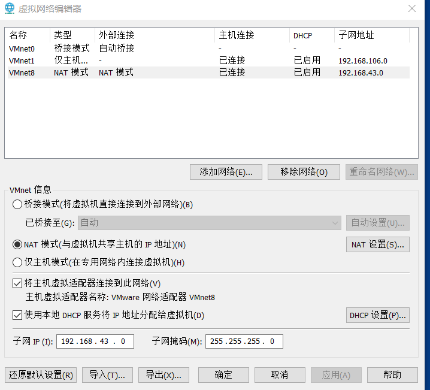
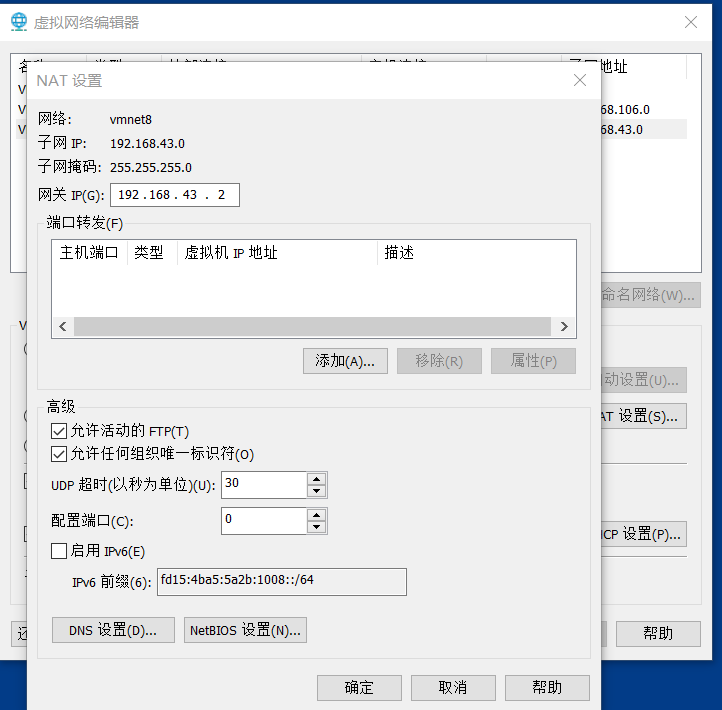
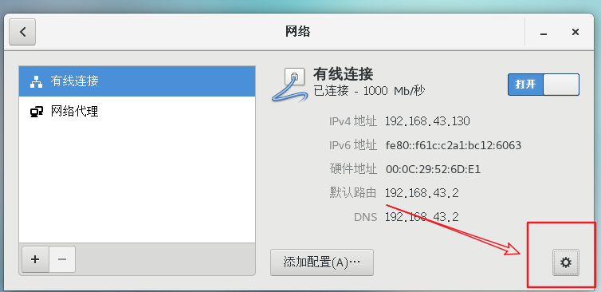
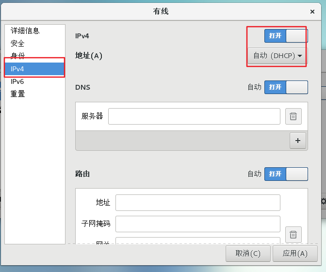
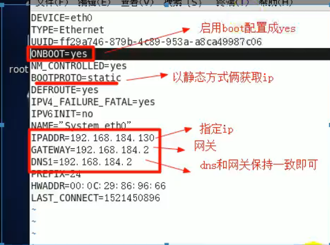

[TOC]

# 网络配置

## Linux网络配置原理

> 虚拟机NAT网络配置原理

## 查看网络IP和网关

### 虚拟机网络编辑器

### 修改IP地址

### 查看网关

### 查看windows中的虚拟网卡的ip地址

- windows中使用ipconfig查看ip配置

## ping测试

> 基本语法: ping [主机地址]

- 例如： ping [www.baidu.com](http://www.baidu.com/)

## Linux网络环境配置

### 自动抓取

centos7.4设置：

- ​	
- 

**`缺点：`** 每次自动获取的ip地址可能不一样，不适用于做服务器

### 指定ip地址

1. 直接修改配置文件来指定IP，并可以连接到外网，编辑：vim /etc/sysconfig/network-scripts/ifcfg-eth0 
   1. 这是centos6.8的配置，centos7的配置文件位置有所不同
   2. cd /etc/sysconfig/network-scripts/ifcfg-ens33
   3. 
2. 重启网络服务：service network restart
3. 重启系统：reboot 