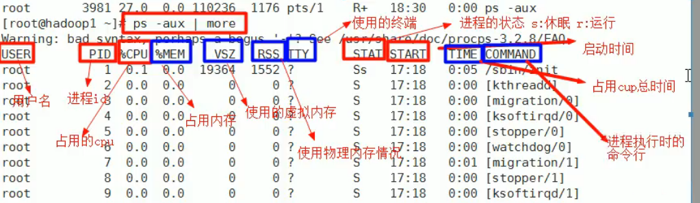
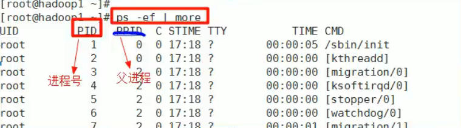
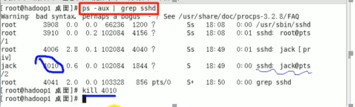
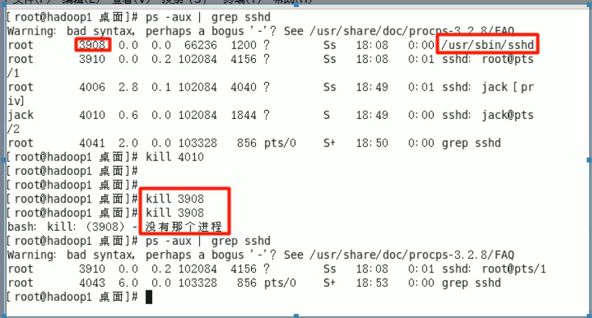
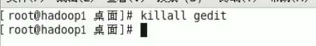

# 进程管理

## 基本介绍

- 在Linux中，每个执行的**程序（代码）**都称为一个进程。每一个进程都分配一个ID号。
- 每一个进程，都会对应一个父进程，而这个父进程可以复制多个子进程。例如www服务器。
- 每个进程都可能以两种方式存在的。**前台与后台**，所谓前台进程就是用户目前的屏幕上可以进行操作的。后台进程则是实际在操作，但由于屏幕上无法看到的进程，通常使用后台方式执行
- 一般系统的服务都是以后台进程的方式存在，而且都会常驻在系统中。直到关机才才结束。

## 显示系统执行的进程

### 基本介绍

ps命令是用来查看目前系统中，有哪些正在执行，以及它们执行的状况可以不加任何参数

- ps -a：显示当前终端的所有进程信息

- ps  -u：以用户的格式显示进程信息
- ps  -x：显示后台进程运行的参数

### ps详解

- 指令：ps -aux grep xxx
- 指令说明
  - System v展示风格
  - USER：用户名称
  - **PID：进程号**
  - **%CPU：进程占用pU的百分比**
  - **%MEM：进程占用物理内存的百分比**
  - **VSZ：进程占用的虚拟内存大小（单位：KB）**
  - **RSS：进程占用的物理内存大小（单位：KB）**
  - TT：终端名称缩写
  - STAT：进程状态，其中s睡眠，s表示该进程是会话的先导进程，N表示进程拥有比普通优先级更低的优先级，R-正在运行，D短期等待，z僵死进程，T被跟踪或者被停止等等
  - STARTED：进程的启动时间
  - TME:CPU时间，即进程使用CPU的总时间
  - COMMAND：启动进程所用的命令和参数，**如果过长会被截断显示**

### 应用实例

要求：以全格式显示当前所有的进程，查看进程的父进程。

- ps -ef是以全格式显示当前所有的进程
- -e显示所有进程。-f全格式。
- ps -ef grep xox
  - 是BSD风格
  - UID：用户ID 
  - PID：进程ID 
  - PPID：父进程ID 
  - C:CPU用于计算执行优先级的因子。数值越大，表明进程是cpU密集型运算执行优先级会降低；数值越小，表明进程是I/O密集型运算，执行优先级会提高
  - STIME：进程启动的时间
  - TTY：完整的终端名称
  - TIME:CPU时间
  - CMD：启动进程所用的命令和参数

## 终止进程kill和killall

### 介绍：

若是某个进程执行一半需要停止时，或是已消了很大的系统资源时，此时可以考虑停止该进程。使用kl命令来完成此项任务。

### 基本语法：

kill【选项】进程号（功能描述：通过进程号杀死进程

killall 进程名称（功能描述：通过进程名称杀死进程，也支持通配符，这在系统因负载过大而变得很慢时很有用）

### 常用选项：

-9：表示强迫进程立即停止

### 最佳实践

- 案例1：踢掉某个非法登录用户
  - 

- 案例2：终止远程登录服务sshd，在适当时候再次重启sshd服务
  - 

- 案例3：终止多个 gedit编辑器案例4：强制杀掉一个终端
  - 