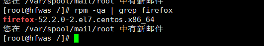
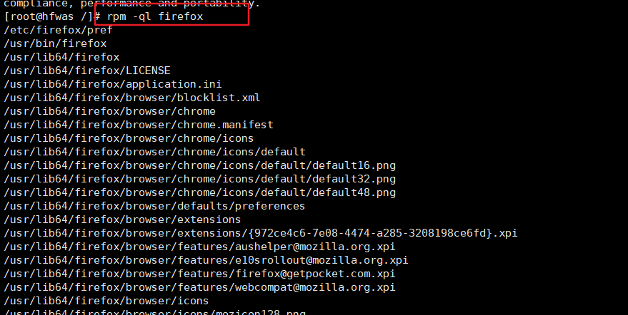
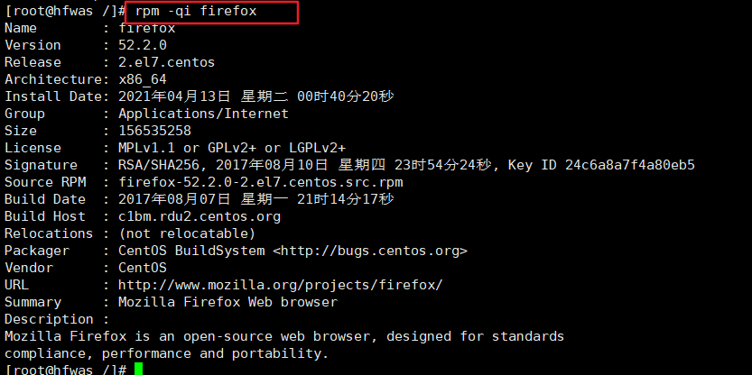
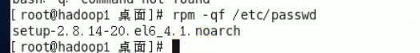

# RPM和YUM

## rpm包的管理

### 介绍

一种用于互联网下载包的打包及安装工具，**它包含在某些Linux分发版中**。它生成具有RPM扩展名的文件。RPM是 RedHat Package Manager（ RedHat软件包管理工具）的缩写，类似 windows的 setup.exe，这一文件格式名称虽然打上了 RedHat的标志，但理念是通用的。

Linux的分发版本都有采用（**suse, redhat, centos**等等），可以算是公认的行业标准了。

### rpm包的简单查询指令：

查询已安装的rpm列表rpm	-qa | grep xx 

### rpm包名基本格式

一个rpm包名：firefox-45.0.1-el6.centos. x86_64.rpm

- 名称：firefox
- 版本号：45.0.1-1
- 适用操作系统：el6.centos .x86_64
- 表示 centos6x的64位系统
- 如果是i686、i386表示32位系统， noarch表示通用。

### rpm包的其它查询指令

rpm-ga：查询所安装的所有rpm软件包

rpm -qa | more  分页展示

rpm -qa grep X【**rpm -qa  |  grep firefox** 】 

rpm -ql 软件包名:查询软件包中的文件

rpm  -ql  firefox 

rpm -qi firefox 查看安装程序的详细信息

rpm-qa | grepfirefox

rpm-q 软件包名：查询软件包是否安装

rpm-qf文件全路径名查询文件所属的软件包

rpm -qf /etc/passwd   查询某个文件属于那个软件

rpm -qf /root/install.log 

rpm qi 软件包名：查询软件包信息

rpm-qi file