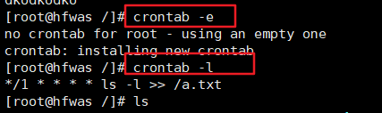
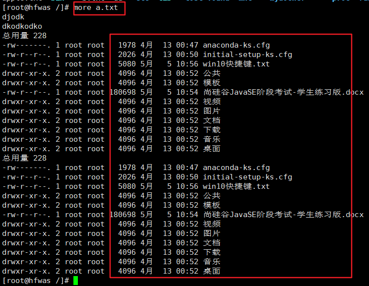
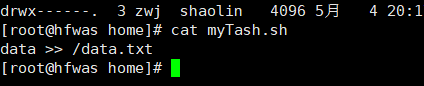
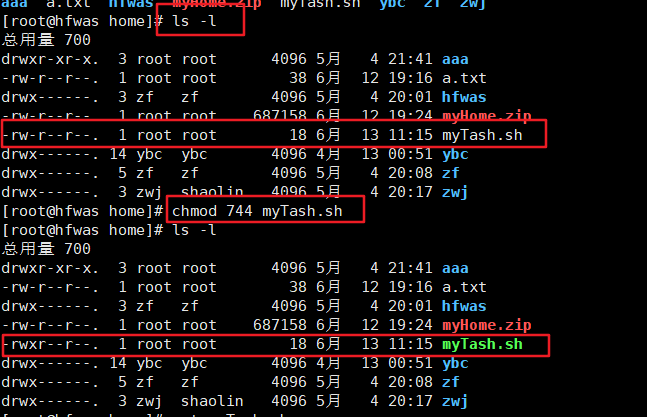
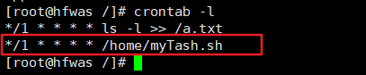
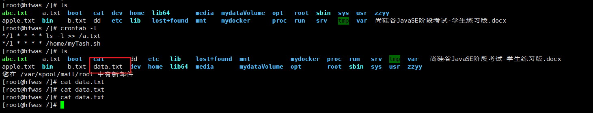

[toc]

# Linux中定时任务调度

## 概述

- 任务调度：是指系统在某个时间执行的特定的命令或程序

- 任务调度分类：

  - 系统工作：有些重要的工作必须周而复始地执行。如病毒扫描等
  - 个别用户工作：个别用户可能希望执行某些程序，比如对mysq数据库的备份。

- 基本语法

  - crontab【选项】

- 常用选项

  crontab定时任务查询 

  crontab任务删除当前用户所有的 crontab任务

## 任务调度原理

- 使用方法：crontab [选项]
  - crontab [选项]
  - -e：编辑crontab定时任务
  - -i：查询crontab任务
  - -r：删除当前用户所有的crontab任务
  - -l：列出当前有哪些任务调度
  - systemctl restart  crond：重启任务调度
    - 
  - 当保存退出后就生效了
  - 参数细节说明

| 项目      | 含义                 | 范围                    |
| --------- | -------------------- | ----------------------- |
| 第一个“*” | 一小时当中的第几分钟 | 0-59                    |
| 第二个“*” | 一天当中的第几小时   | 0-23                    |
| 第三个“*” | 一个月当中的第几天   | 1-31                    |
| 第四个“*” | 一年当中的第几月     | 1-12                    |
| 第五个“*” | 一周当中的星期几     | 0-7（0和7都代表星期日） |

- 特殊符号说明

  - `\*：`代表任何时间。比如第一个*就代表一小时中每分钟都执行一次的意思。
  - `,：`代表不连续的时间。比如“0 8,12,16 * * *命令”，就代表在每天的8点0分，12点0分，16点0分都执行一次命令。
  - `-：`代表连续的时间范围。比如“0 5 * * 1-6命令”，代表在周一到周六的凌晨5点0分执行命令。
  - `/n：`代表每隔多久执行一次。比如“*/10 * * * * 命令”，代表每隔10分钟就执行一遍命令。

- 参数细节说明

  - 特定时间执行任务案例

  - | 时间               | 含义                                                         |
    | :----------------- | ------------------------------------------------------------ |
    | 45 22 * * * 命令   | 在22点45分执行命令                                           |
    | 0 17 * * 1 命令    | 每周1的17点0分执行命令                                       |
    | 0 5  1,15 * * 命令 | 每月1号和15号的凌晨5点0分执行命令                            |
    | 40 4 * * 1-5 命令  | 每周一到周五的凌晨4点40分执行命令                            |
    | */10 4 * * * 命令  | 每天的凌晨4点，每隔10分钟执行一次命令                        |
    | 0 0 1,15 * 1 命令  | 每月1号和15号，每周1的0点0分都会执行命令。注意：星期几和几号最好不要同时出现，因为他们定义的都是天。非常容易让管理员混乱 |

## 任务的要求

- 设置任务调度文件：crontab

- 设置个人任务调度。执行 crontab-e命令

- 接着输入任务到调度文件
- 如：*/l   * * * * ls  -l   /etc/  >   /a.txt
  - 
- 意思说每小时的每分钟执行ls -l /etc/ > /a.txt命令
  - 

## 任务调度的案例：

- 案例：每隔1分钟，就将当前的日期信息，追加到 /data文件中
  - 编写脚本：这里参数写错了，date写成了data，不过不影响理解
    - 
  - 给脚本执行权限，可以看到当前脚本没有执行权限
    - 
  - crontab -e
  - 
  - 