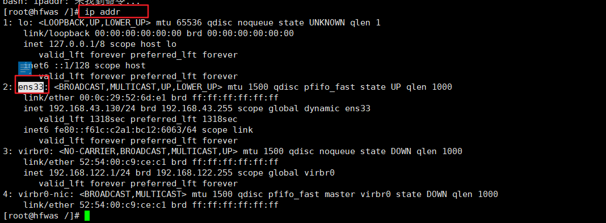
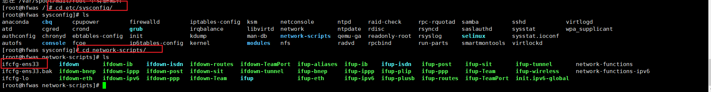
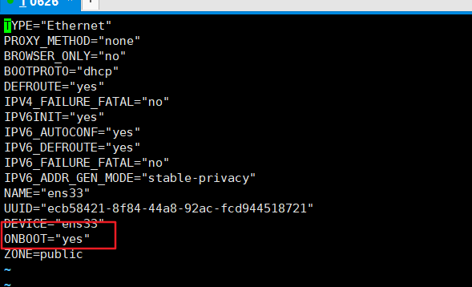

# cnetos7配置自动获取IP地址

- .输入“ip addr”并按回车键确定，发现无法获取IP,记录下网卡名称（本例中为ens33）。
  - 

- .输入“cd /etc/sysconfig/network-scripts/”按回车键确定，继续输入“ls”按回车键查看文件。
  - 

- 按“i”键进入编辑状态，将最后一行“no”修改为“yes”，然后按“ESC”键退出编辑状态，并输入“:wq!”保存退出。
  - 由于我已经设置过了自动获取IP地址，这里的ONBOOT值为“yes”,正常情况下为no
  - 

- 输入“service network restart”重启服务,亦可输入“systemctl restart netwrok”。
- 再次输入“ip addr”查看，现已可自动获取IP地址。